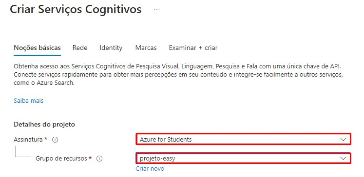

# Extração de textos de imagens no Azure ML

1. Acessar a página inicial da azure no link: https://portal.azure.com, e clicar em "Criar um recurso".

 

2. No menu de opções na lateral esquerda, clicar em "IA + Machine Learning".

 

3. Na opção "Serviços Cognitivos" clicar em "Criar".

 

4. Em "Detalhes do projeto", não alterar a opção de assinatura. Em "Grupo de recursos" escolha um já criado ou crie um novo no botão abaixo "Criar novo".

 

5. Descendo a tela, temos os detalhes da instância, é recomendado não utilizar servidores da região do Brasil, por questões de instabilidade, aqui utilize a já indicada pela Azure ou "East US". Em "Nome" coloque um nome de sua preferência. Em "Tipo de preço" escolha a opção padrão. E confirme a checkbox sobre os preços abaixo.  

 

6. Revise tudo e clique no botão "Examinar + criar" na lateral inferior esquerda

 

7. Você será redirecionado a outra página com os termos, clique em "Criar" na lateral inferior esquerda

 

8. Após ser redirecionado, deve aparecer um card de exito. Após isso acesse: https://portal.vision.cognitive.azure.com. (Talvez seja necessário refazer o login de sua conta)

 

9. Na tela inicial do Vision Studio, clique em "View all resources".

 

10. Selecione o recurso criado na checkbox a esquerda do nome dele. E aperte em "Select as default resource". Ele não vai indicar nenhum feedback, então pode fechar a tela no botão na lateral superior direita.

 

11. Ao retornar a tela inicial, clique na seção "Optical character recognition".

 

12. Clique no card "Extract text from images"

 

13. Clique no checkbox para reconhecer o uso de recursos.

 

14. É possível utilizar o recurso colocando uma imagem própria, clicando em "Browse for a file", onde ele pedirá uma foto do seu computador, em "Take a photo", onde ele tirará uma foto na hora. Ou também é possível utilizar uma das fotos pré selecionadas ao lado.

 

15. Na opção "Detected attributes" ele indica os textos na imagem, em "JSON" ele mostra o código de identificação do texto.

 
 

